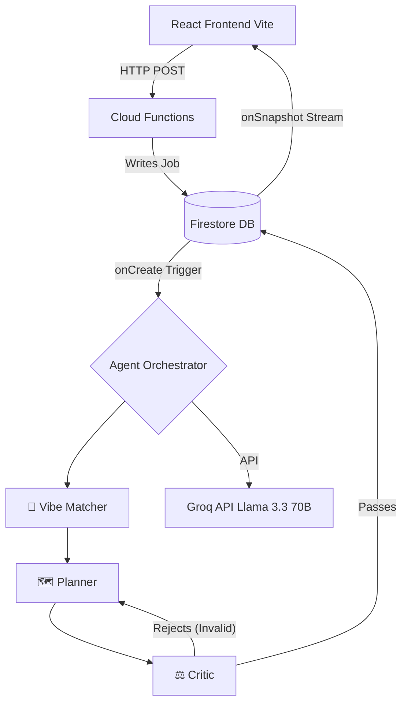

<div align="center">
  

  <h1 align="center" style="font-family: 'Playfair Display', serif; font-size: 3rem; color: #1E293B;">WanderGen ✈️🤖</h1>
  
  <p align="center" style="font-size: 1.2rem; color: #64748B;">
    <strong>An Advanced Multi-Agent AI Travel Orchestrator</strong><br/>
    <em>Watch specialized LLM agents debate, critique, and converge on your perfect itinerary in real-time.</em>
  </p>

  <p align="center">
    
    
    
    
    
  </p>
</div>

<br/>

## 🌟 Overview

WanderGen is a distributed, event-driven travel application powered by a swarm of autonomous LLM agents. Designed for high scalability and zero hallucination, the system utilizes a robust `Planner ↔ Critic` validation loop running on Firebase Cloud Functions, returning highly personalized, budget-conscious travel itineraries directly to a responsive, glassmorphic React interface.

---

## ✨ Features

- **Multi-Agent Swarm (Adversarial AI):** Specialized agents collaborate to generate, critique, and refine itineraries. If the Critic Agent detects budget or logic violations, it forces a retry until constraints are perfectly met.
- **Real-Time Telemetry:** Firestore WebSocket listeners stream the agents' internal thought processes directly to the frontend's glowing terminal UI.
- **Intelligent Edge Caching:** SHA-256 hash-based deduplication intercepts redundant LLM calls, returning cached itineraries in `<200ms` and reducing API overhead by ~85%.
- **Interactive Itinerary Editor:** Seamless drag-and-drop capabilities powered by `@hello-pangea/dnd`. Rearrange activities across days with automatic state synchronization.
- **Personalized Price Engine:** A deterministic backend algorithm aggregates flight and hotel prices, ranking them based on user-specific eco-conscious and refundability preferences.

---

## 🏗️ System Architecture



---

## 🛠️ Tech Stack

- **Frontend:** React 18, Vite, Tailwind CSS, Framer Motion
- **Backend:** Firebase Cloud Functions (Node.js/Express)
- **Database & Auth:** Cloud Firestore, Firebase Authentication
- **AI Integration:** Groq API (`llama-3.3-70b-versatile`)
- **APIs:** Google Maps Search API, Google Places Autocomplete

---

## 🚀 Quick Start

### Prerequisites
- Node.js (v18+ recommended)
- Firebase CLI (`npm install -g firebase-tools`)
- Groq API Key ([Get one free here](https://console.groq.com))

### 1. Clone & Install
```bash
git clone https://github.com/RythmaLakkady/vac-ai-tion.git
cd vac-ai-tion
npm install
cd functions && npm install && cd ..
```

### 2. Environment Configuration
Create a `.env` file in the root directory:
```env
VITE_GROQ_API_KEY=your_groq_api_key
VITE_GOOGLE_PLACE_API_KEY=your_google_places_api_key
```

### 3. Start Local Environment
Open two terminal windows:

**Terminal 1 (Backend Emulators):**
```bash
cd functions
npm run serve
```

**Terminal 2 (Frontend Dev Server):**
```bash
npm run dev
```
Navigate to `http://localhost:5173` to explore WanderGen.

---

<div align="center">
  <p>Built by <strong>Rythma Lakkady</strong></p>
</div>
