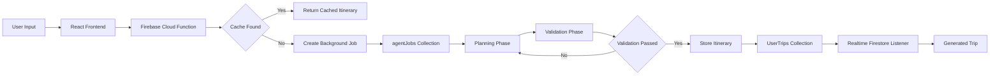

<h1 align="center">✈️ vac-ai-tion</h1>

<p align="center">
<b>AI-Powered Travel Planning Platform with Asynchronous LLM Orchestration</b>
</p>

<p align="center">
Generate personalized travel itineraries through an asynchronous AI orchestration pipeline with real-time execution tracking, intelligent caching, and iterative itinerary refinement.
</p>

<p align="center">

<a href="https://vac-ai-tion.vercel.app">

</a>

<a href="https://github.com/RythmaLakkady/vac-ai-tion">

</a>

</p>

<p align="center">


</p>

---

# Overview

vac-ai-tion is an AI-powered travel planning platform that generates personalized itineraries through an asynchronous multi-stage orchestration pipeline.

Rather than waiting for a single long-running AI request to complete, itinerary generation is executed as a background workflow using Firebase Cloud Functions. The frontend streams progress updates in real time while separate planning and validation phases iteratively refine the itinerary before it is saved.

To reduce unnecessary inference costs and improve responsiveness, identical requests are detected using SHA-256 hashing and served directly from a Firestore-backed cache whenever possible.

---

# Why vac-ai-tion?

Planning a trip often involves repeatedly switching between travel websites, maps, hotel listings, and conversational AI tools while manually organizing an itinerary.

vac-ai-tion brings these tasks into a single application by combining AI-powered itinerary generation, conversational travel assistance, secure authentication, persistent trip history, and real-time generation tracking.

Instead of treating AI as a single prompt, the project explores how multi-stage orchestration, validation, caching, and asynchronous processing can improve the reliability and usability of AI-assisted travel planning.

---

# Key Features

| Feature | Description |
|----------|-------------|
| 🤖 **Multi-Stage AI Planning** | Generates itineraries through separate planning and validation phases. |
| 🌍 **Location Search** | Uses the LocationIQ API for destination search and geolocation support. |
| ⚡ **Asynchronous Job Processing** | Uses Firebase Cloud Functions to execute itinerary generation without blocking the frontend. |
| 📡 **Real-Time Progress Updates** | Streams backend orchestration logs using Firestore listeners. |
| 🔄 **Iterative Refinement Loop** | Regenerates itineraries when validation detects unmet constraints. |
| 📦 **Intelligent Request Caching** | Prevents redundant LLM calls through SHA-256 request hashing. |
| 💬 **AI Travel Assistant** | Conversational interface for travel-related guidance. |
| 🧳 **Interactive Itinerary Editing** | Drag-and-drop itinerary management for generated activities. |
| 🔐 **Authentication** | Firebase Email/Password and Google OAuth authentication. |
| ☁️ **Cloud-Native Architecture** | Built using Firebase Cloud Functions, Firestore, and Vercel. |


---

# 🏗️ System Architecture


---

# ⚙️ How It Works

## Step 1 — Trip Request

The user provides:

- Destination
- Number of travel days
- Budget
- Number of travelers

The frontend submits these details to a Firebase Cloud Function instead of directly calling the LLM.

---

## Step 2 — Intelligent Request Caching

To reduce unnecessary LLM inference, the backend computes a SHA-256 hash from the request parameters.

If an identical itinerary already exists in the cache, the cached result is immediately returned.

Otherwise, a new background generation job is created.

---

## Step 3 — Background Orchestration

The backend creates a new job document inside the **agentJobs** Firestore collection and immediately returns a **202 Accepted** response.

This allows the frontend to remain responsive while itinerary generation continues asynchronously.

---

## Step 4 — Planning Phase

The orchestration pipeline requests an itinerary from Groq's Llama 3.3 70B model.

The model is instructed to generate structured JSON containing:

- Hotel recommendations
- Daily itinerary
- Estimated costs
- Geographic coordinates
- Booking links

---

## Step 5 — Validation Phase

Instead of accepting the first generated itinerary, a second LLM prompt evaluates whether the response satisfies the requested constraints.

Examples include:

- Requested number of days
- Budget limits
- JSON structure
- Overall itinerary consistency

If validation fails, the planner receives feedback and generates a revised itinerary.

The process repeats for a maximum of **three iterations**.

---

## Step 6 — Real-Time Progress Updates

While the orchestration pipeline is running, backend logs are continuously written to Firestore.

The frontend subscribes to these updates using Firestore's real-time listener (`onSnapshot`), allowing users to follow itinerary generation through a live terminal interface.

---

## Step 7 — Trip Persistence

Once generation completes successfully:

- The itinerary is stored in the **UserTrips** collection.
- The background job status is marked as **Completed**.
- The frontend automatically redirects the user to the generated itinerary.

---

# 📂 Project Structure

```text
vac-ai-tion

├── src/
│   ├── components/
│   ├── pages/
│   ├── service/
│   ├── firebase/
│   ├── assets/
│   └── hooks/
│
├── functions/
│   ├── agentOrchestrator.js
│   ├── index.js
│   └── utils/
│
├── public/
│
├── package.json
│
└── README.md
```

---

# 🛠️ Technology Stack

| Layer | Technology |
|--------|------------|
| **Frontend** | React 18 + Vite |
| **Styling** | Tailwind CSS, Framer Motion |
| **Routing** | React Router DOM |
| **Authentication** | Firebase Authentication |
| **Database** | Firestore |
| **Backend** | Firebase Cloud Functions |
| **AI Models** | Groq (Llama 3.3 70B) |
| **Location Services** | LocationIQ API |
| **Hosting** | Vercel |
| **Drag & Drop** | @hello-pangea/dnd |

---

# 💡 Engineering Decisions

The project intentionally separates itinerary generation into multiple stages instead of relying on a single long-running LLM request.

This architecture was chosen to improve responsiveness, simplify failure recovery, and create a more transparent user experience during AI generation.

---

## Asynchronous Backend Processing

Instead of waiting for itinerary generation to complete before responding, the backend immediately creates a background job and returns a **202 Accepted** response.

This allows the frontend to remain interactive while the itinerary is generated independently.

**Benefits**

- Responsive user interface
- Non-blocking request handling
- Easier orchestration of long-running AI tasks

---

## Intelligent Request Caching

Generating identical itineraries repeatedly results in unnecessary LLM inference and increased latency.

To reduce duplicate work, the backend computes a SHA-256 hash from the request parameters.

If an identical request has already been processed, the cached itinerary is returned immediately without invoking the LLM.

**Benefits**

- Lower inference cost
- Faster response time
- Reduced backend workload

---

## Iterative AI Validation

Instead of assuming the first generated response is correct, itinerary generation includes a validation stage.

A second LLM prompt evaluates whether the generated itinerary satisfies the requested constraints such as travel duration, budget, and output structure.

If validation fails, the planner receives structured feedback and generates a revised itinerary.

The process repeats for a limited number of iterations.

**Benefits**

- More reliable outputs
- Better adherence to user constraints
- Reduced malformed responses

---

## Real-Time Progress Streaming

Rather than displaying a loading spinner, the frontend streams orchestration logs from Firestore using real-time listeners.

This provides users with visibility into each stage of itinerary generation while the backend continues processing.

**Benefits**

- Improved transparency
- Better user experience
- Continuous feedback during long-running operations

---

# 📊 Firestore Data Model

The application uses three primary Firestore collections.

| Collection | Purpose |
|------------|---------|
| **UserTrips** | Stores completed itineraries and trip metadata. |
| **agentJobs** | Tracks background itinerary generation jobs and execution logs. |
| **itineraryCache** | Stores cached itinerary responses using SHA-256 request hashes. |

---

# 🔄 Generation Pipeline

```text
User Request
      │
      ▼
Cloud Function
      │
      ▼
Generate Request Hash
      │
      ▼
Cache Lookup
      │
 ┌────┴────┐
 │         │
Hit       Miss
 │         │
 ▼         ▼
Return   Create Job
Cached       │
Trip         ▼
        Planning Phase
              │
              ▼
       Validation Phase
              │
      ┌───────┴────────┐
      │                │
   Retry          Validation Passed
      │                │
      ▼                ▼
 Planning       Save to Firestore
      │                │
      └───────┬────────┘
              ▼
     Stream Progress Logs
              │
              ▼
     Display Generated Trip
```

---
# ⚙️ Installation

## Prerequisites

Before running the project, ensure you have:

- Node.js 18+
- npm
- Firebase Project
- Groq API Key

---

## Clone the Repository

```bash
git clone https://github.com/RythmaLakkady/vac-ai-tion.git

cd vac-ai-tion
```

---

## Install Dependencies

```bash
npm install
```

---

## Environment Variables

Create a `.env` file in the project root.

```env
VITE_GROQ_API_KEY=your_groq_api_key

VITE_LOCATIONIQ_API_KEY=your_locationiq_api_key

VITE_PRICE_FUNCTION_URL=your_cloud_function_url
```

---

## Start Development Server

```bash
npm run dev
```

---

## Deploy Firebase Functions

```bash
cd functions

npm install

firebase deploy --only functions
```

---

# 🚀 Getting Started

1. Sign in using Email/Password or Google Authentication.

2. Create a new trip by selecting:

   - Destination
   - Budget
   - Number of Days
   - Number of Travelers

3. Submit the request.

4. Monitor itinerary generation through the real-time Generation Console.

5. Review the generated itinerary.

6. Rearrange activities using drag-and-drop.

7. Access previous trips anytime from your profile.

---

# 🎯 Future Improvements

The project is actively evolving.

Planned enhancements include:

### AI

- [ ] Multi-model support (OpenAI, Anthropic, Gemini)
- [ ] Weather-aware itinerary generation
- [ ] Local event recommendations
- [ ] Restaurant recommendations
- [ ] Personalized activity ranking

---

### Platform

- [ ] Trip collaboration
- [ ] Offline itinerary access
- [ ] Calendar integration
- [ ] Export to PDF
- [ ] Multi-language support

---

### Engineering

- [ ] Background queue system
- [ ] Function-level monitoring
- [ ] Docker support
- [ ] CI/CD pipeline
- [ ] End-to-end testing

---

# 🤝 Contributing

Contributions are welcome.

If you'd like to improve the project:

1. Fork the repository.

2. Create a feature branch.

3. Commit your changes.

4. Submit a Pull Request.

For larger changes, please open an Issue first to discuss the proposed design.

---

# 📄 License

This project is licensed under the **MIT License**.

---

<p align="center">

Built with ❤️ using React, Firebase, Firestore, Groq, and Vercel.

If you found this project useful, consider giving it a ⭐.

</p>
